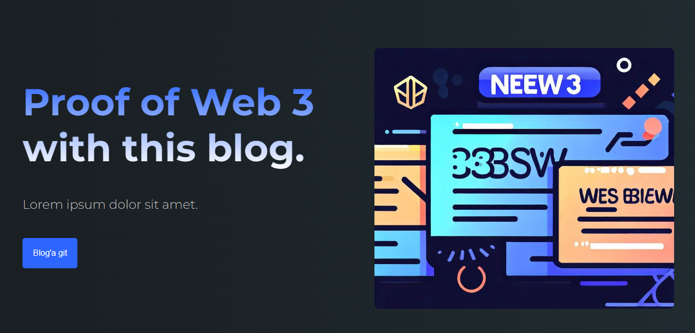

# Proof Web 3

Next.js ile web projesi



## Başlarken

Önce 
```bash
npm i

yarn install
```
Daha sonra

```bash
npm run dev

yarn dev
```
ile çalıştırabilirsiniz. 

<a href="https://github.com/berkercelik/proofweb3/commits/main" style="color:lime">>_ Commits</a>


